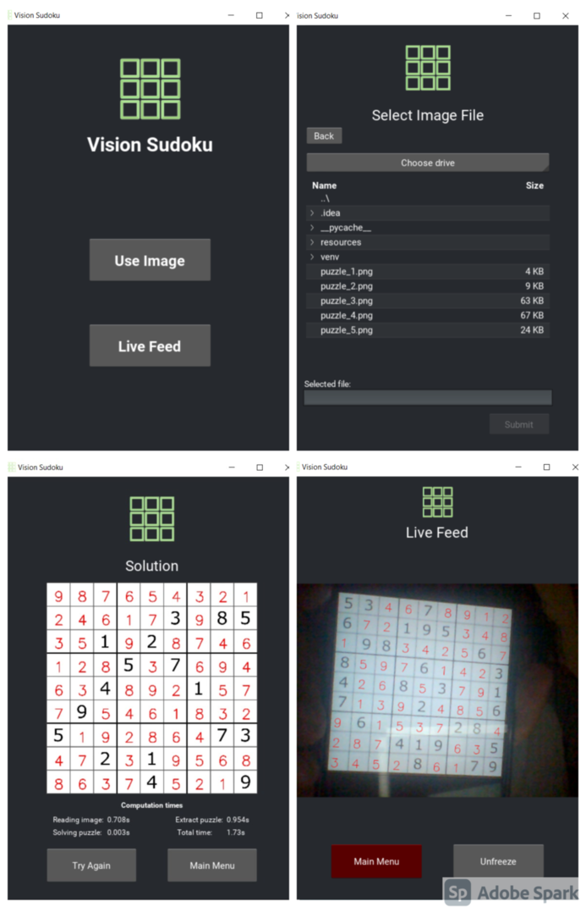

# vision-sudoku-solver
A Sudoku puzzle solver that reads the puzzle from images. It works with
an image file (.png or .jpeg) or Web Cam feed. The solution will be
printed on the input image/ live feed itself.

Run the **main.py** file to open up the graphical interface.

The **grid_analyzing/vision_solver.py** file contains the endpoints of
the program (if the GUI is not going to be used).

**Note:** Make sure the input image is not too small in size.

The digit recognition is done through a neural network, and data set
generation script and a training script is also included in this
repository.

